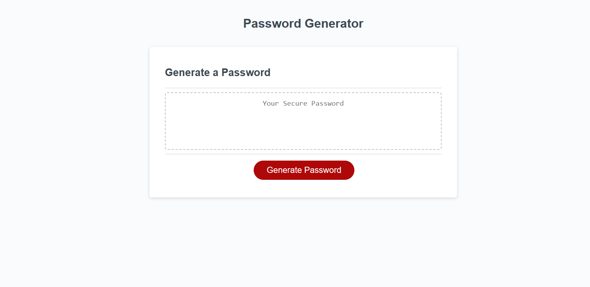

# PasswordGenJavascript

[my live site](https://teelsam.github.io/PasswordGenJavascript/)

## Description

    Here is my password generator button with questions that add specificity to the password generated. This being a week three challenge, we are given a started code and have to work around learning its already created pieces which we will add our code to. In this case i added the generatepassword() functions code. Using the code we learned in our first week of javascript I have coded alot of if/elses.

## Usage

    Simply press the big red button and follow through the questions allowing for a password between 8 and 128 characters to be created.

## Table of Contents

    An index.html  file holding the sites elements.
    This README.md file explaining the contents and project usage.
    A screen shot of the live site.
    The script.js javascript file holding the moving parts code.
    And finally the style.css file which makes the site look so good.

## ScreenShot

.
